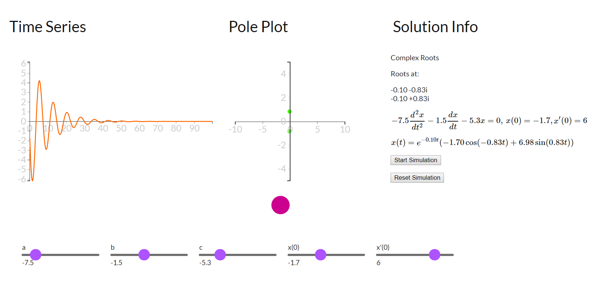

# diffEqWebApp

Web App for teaching 2nd order linear differential equations with constant coefficients.

I designed this to help students gain some intution about what the solutions to these equtions look like and how the various coefficients, and initial conditions effect the solutions.

Use the sliders to vary the constants and intial conditions.

Plots the time series (with initial conditions) and poles (assuming initial rest) of the equation solution.

Press "Start simulation" button and the pink ball will move according to the solution.

There may be some gitches in the solutions, so use at your own risk, but it will help in gaining some insight.

diffEqWebApp/screenshot.PNG

